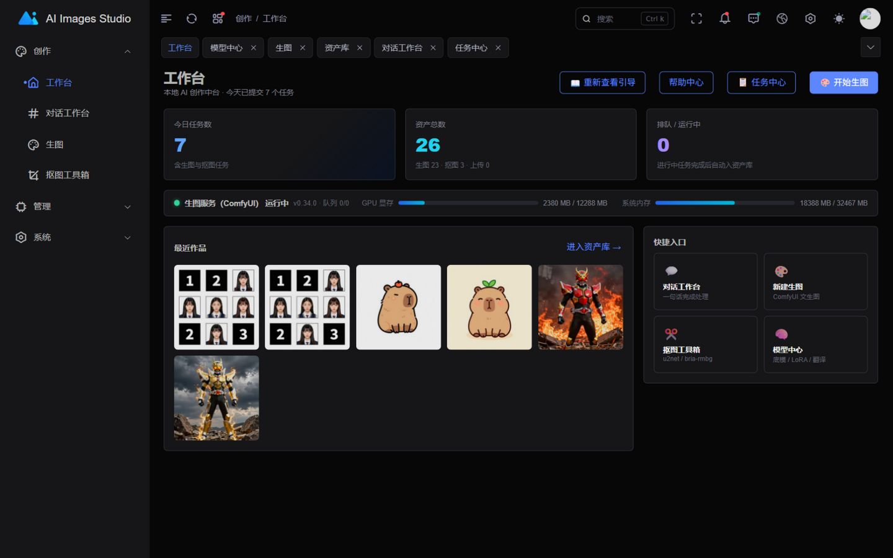
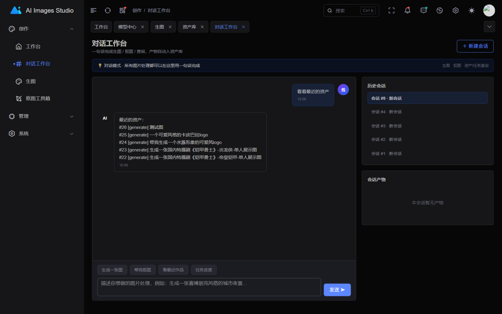
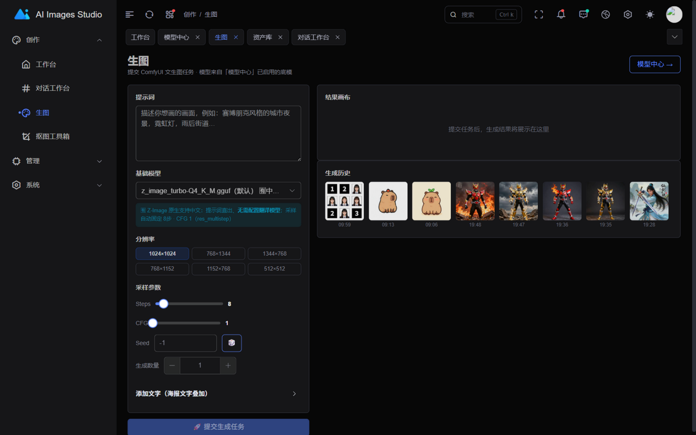
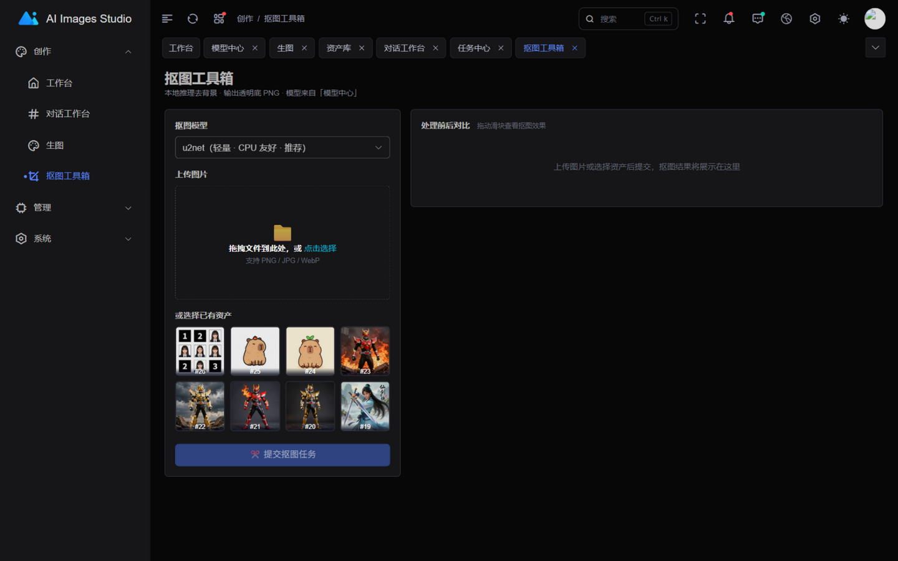
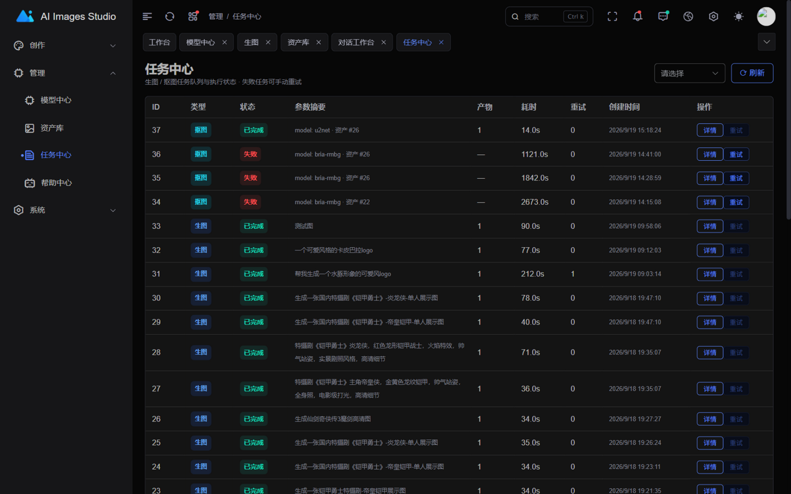
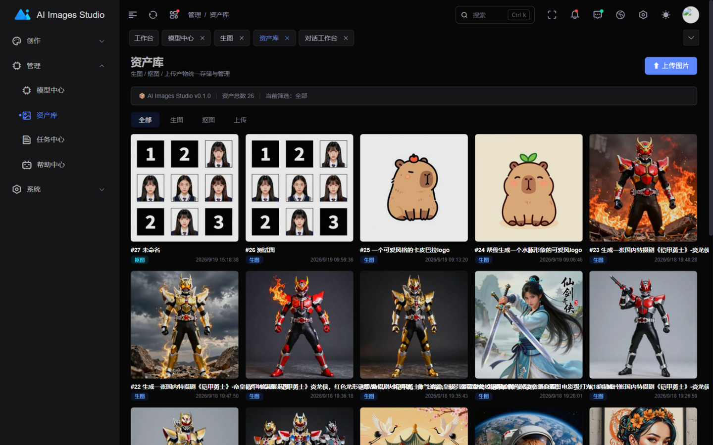

# AI Images Studio

<div align="center">

**一站式本地 AI 图像创作与管理工作台**

[简体中文] | [English](README.md)

对话式生图 · 文生图 · 智能抠图 · 模型中心 · 资产库 · 任务队列 · MCP Server

FastAPI + Vue3 + ComfyUI · 前后端同端口一体化 · Docker 一键部署

</div>

---



## ✨ 项目简介

AI Images Studio 是一个**自托管**的 AI 图像创作中台：把 ComfyUI 生图引擎、智能抠图、模型管理、资产库与异步任务队列整合到一个 Web 工作台里，并提供 **MCP Server** 供外部 AI Agent 直接调用。

设计目标：

- **对话优先**：在对话工作台用一句中文完成生图 / 抠图 / 查询，产物自动入资产库
- **中文友好**：原生支持中文提示词底模（Z-Image Turbo GGUF + Qwen3 文本编码器），指令式需求自动改写为描述性画面提示词；SDXL 系底模自动走"翻译模型增强"链路
- **低门槛部署**：单容器跑起前后端 + SQLite，唯一的外部依赖是宿主机上的 ComfyUI
- **可观测**：系统状态面板实时展示 ComfyUI 连通性、GPU 显存、系统内存与队列；服务未启动时生图/对话立即得到明确提示，绝不静默失败
- **硬件宽容的异步任务**：轮询等待带平滑进度条、瞬断自动重试、按任务类型的宽松超时——慢显卡 / 低功耗小主机（ARM 盒子）同样好用

## 🖼️ 界面截图

| 对话工作台 | AI 生图 |
| --- | --- |
|  |  |

| 抠图工具箱 | 任务中心（含提示词/参数详情） |
| --- | --- |
|  |  |

| 资产库 | 工作台概览 |
| --- | --- |
|  |  |

## 🧩 功能模块

| # | 模块 | 路由 | 说明 |
|---|------|------|------|
| 1 | 工作台概览 | `#/creation/home` | 今日任务/资产统计、**系统状态面板**（ComfyUI 状态灯 + GPU 显存/内存仪表，30s 自动刷新）、最近作品、快捷入口 |
| 2 | 对话工作台 | `#/creation/chat` | 自然语言驱动生图/抠图/查询，消息内嵌产物图，产物可查看**生成详情**（完整提示词/模型/参数），失败任务气泡内一键重试，服务未启动横幅提示 |
| 3 | AI 生图 | `#/creation/generate` | ComfyUI 文生图：模型选择（单文件底模 / GGUF 量化底模）、尺寸预设、steps/cfg/seed、LoRA 挂载、批量生成、海报文字叠加 |
| 4 | 智能抠图 | `#/creation/matting` | 上传或选资产一键去背景（u2net / bria-rmbg / birefnet），前后对比滑块 + 下载 |
| 5 | 模型中心 | `#/studio/models` | 底模/LoRA/翻译/抠图四类模型统一管理：启停、设默认、一键从 ComfyUI 同步模型列表 |
| 6 | 资产库 | `#/manage/assets` | 生图/抠图/上传产物统一浏览、筛选、下载、删除，点开**详情弹窗**查看生成时的提示词与全部参数 |
| 7 | 任务中心 | `#/manage/tasks` | 异步任务队列跟踪（queued/running/done/failed），**详情弹窗**（提示词/模型/采样参数/失败原因），失败自动重试 + 手动重试 |
| 8 | 系统设置 | `#/studio/settings` | 只读运行信息（端口/数据目录/ComfyUI 端点）+ 关于 |

> 登录采用单字段 Token 方式：输入 `.env` 中配置的 `STUDIO_TOKEN` 即可，无用户名/密码。

## 🎯 核心特性

### 对话式创作
- 规则引擎意图路由（生图/抠图/资产查询/任务查询），预留 `LlmAdapter` 接口可平滑接入大模型编排
- 中文指令自动处理：「帮我生成一张赛博朋克城市夜景」→ 意图识别 → 提取提示词 → 入队 → 完成后产物内嵌回对话
- 指令式提示词（如"生成一张 xxx 单人展示图"）自动改写为**描述性画面提示词**，专有名词原样保留，显著提升角色命中率

### 提示词智能增强
- **Z-Image Turbo（原生中文）**：指令式需求经已配置的翻译 LLM 改写为纯描述性中文，已是描述则原样直出
- **SDXL 系底模**：中文 → 翻译模型翻译为英文关键词；翻译模型不可用时回退内置关键词映射表
- 反向提示词自动按绘画/摄影类别追加质量负面词

### 系统状态与容错
- `GET /api/system/status`：ComfyUI 版本、GPU 设备与显存占用、系统内存、执行中/排队任务数；ComfyUI 不可达时降级返回 `status=stopped`，接口永不 500
- 生图提交与对话生图意图**前置预检**：ComfyUI 未启动时立即返回明确错误（HTTP 503 / 对话内提示），不让任务入队后空转
- **硬件宽容的等待交互**：任务轮询对瞬断自动退避重试（连续 10 次失败才判定失联），平滑进度条 + 已等待时长 + 阶段文案；超时按任务类型放宽（抠图 10 分钟、生图 15 分钟）——慢显卡与 ARM 小主机是一等公民
- **崩溃安全的任务队列**：容器重启遗留的 `running` 孤儿任务在 worker 启动时自动重新入队
- SQLite 开启 WAL 模式：任务执行写库不再阻塞 API 轮询（历史 bug：推理期间前端轮询集体超时报"服务器异常"）

### 面向低功耗硬件的智能抠图
- 默认模型 `u2net`（轻量，CPU 数秒~分钟级）；`bria-rmbg` / `birefnet` 效果更好但需要 GPU/强算力
- ONNX 推理线程数可配（`MATTING_THREADS`，默认 3），Web 事件循环不再被饿死；超过 `MATTING_MAX_SIDE`（默认 2048）的输入自动降采样推理、蒙版放大回原尺寸合成——4K 大图不再内存爆/超时

### 异步任务队列
- SQLite 持久化任务表 + asyncio worker 轮询执行，进程重启不丢任务（孤儿任务自动重入队）
- 失败自动重试（默认 2 次，可配），耗尽后标记 failed，支持无限次手动重试

### MCP Server（Agent 接入）
后端同进程挂载 `/mcp`（streamable-http），鉴权同主 API，暴露 4 个工具，外部 Agent（如 Hermes、Claude 等 MCP 客户端）可直接驱动生图/抠图/查询。

## 🏗️ 架构

```
┌────────────────────────────────────────────────────────────┐
│                     docker compose : 8191                  │
│                                                            │
│  ┌──────────────── backend 容器 (uvicorn) ──────────────┐  │
│  │                                                      │  │
│  │  浏览器 ──► / (SPA: Vue3 + art-design-pro, 静态托管) │  │
│  │         ──► /api/*   FastAPI 业务路由 (Bearer 鉴权)  │  │
│  │         ──► /files/* 生成资产静态文件                 │  │
│  │         ──► /mcp      MCP streamable-http Server     │  │
│  │                                                      │  │
│  │  任务 worker(异步队列) ──► ComfyUI(:8188) 生图       │  │
│  │                        ──► rembg 抠图                │  │
│  │  SQLite + 资产文件 ──► /app/data (volume 持久化)     │  │
│  └──────────────────────────────────────────────────────┘  │
└────────────────────────────────────────────────────────────┘
```

- **前端**：Vue3 + TypeScript + Element Plus（[art-design-pro](https://github.com/Daymychen/art-design-pro) 基座），构建产物由后端静态托管，同端口同域
- **后端**：FastAPI + aiosqlite，统一响应 `{code, msg, data}`，Bearer Token 单用户鉴权，内置异步任务队列 worker
- **生图引擎**：原生 ComfyUI HTTP API（`/object_info` `/prompt` `/history` `/view`），支持两类工作流：
  - `checkpoint`：CheckpointLoaderSimple（SDXL 系单文件底模）
  - `z_image`：UnetLoaderGGUF + CLIPLoader(lumina2/Qwen3-4B)（[ComfyUI-GGUF](https://github.com/city96/ComfyUI-GGUF) 量化底模，原生中文）
- **抠图**：rembg（u2net / bria-rmbg / birefnet），CPU 即可运行

## 📦 快速开始

### 前置要求

- Docker + Docker Compose（部署机可以是无 GPU 的小主机/盒子，生图算力在 ComfyUI 侧）
- 一台可访问的 [ComfyUI](https://github.com/comfyanonymous/ComfyUI)（建议与 Studio 部署机同内网）
- （可选）一个 OpenAI 兼容的翻译/改写 LLM 接口，用于中文提示词增强

### 一键部署（Docker）

```bash
git clone https://gitee.com/facio/ai-images-studio.git
cd ai-images-studio

cp .env.example .env
vim .env                      # 修改 STUDIO_TOKEN 为强随机串，配置 COMFYUI_URL
docker compose up -d --build  # 构建并启动（首次构建较慢，含前端编译）
docker compose logs -f studio # 查看日志
```

启动后访问 `http://<主机>:8191`，登录页输入 `STUDIO_TOKEN` 进入工作台。

- 数据持久化：`./data` 挂载为容器 `/app/data`（SQLite + 全部生成资产）
- ComfyUI 在宿主机运行时，`.env` 里配置 `COMFYUI_URL=http://host.docker.internal:8188`（compose 已含 `extra_hosts: host.docker.internal:host-gateway`）
- 健康检查：容器内置 `curl http://127.0.0.1:8191/`，`docker compose ps` 可见 healthy 状态

### 环境变量

| 变量 | 默认值 | 说明 |
|------|--------|------|
| `STUDIO_TOKEN` | `change-me` | 登录 Token（单用户 Bearer），**务必修改为强随机串** |
| `COMFYUI_URL` | `http://host.docker.internal:8188` | ComfyUI 生图引擎地址 |
| `COMFYUI_TIMEOUT` | `300` | 单次生图任务超时（秒） |
| `STUDIO_DATA_DIR` | `/app/data` | 数据目录（SQLite + 资产文件） |
| `STUDIO_PORT` / `PORT` | `8191` | 服务监听端口 |
| `STUDIO_ZIMAGE_TEXT_ENCODER` | `qwen_3_4b_fp8_mixed.safetensors` | Z-Image 文本编码器文件名（ComfyUI models/text_encoders 下） |
| `STUDIO_ZIMAGE_VAE` | `ae.safetensors` | Z-Image VAE 文件名（ComfyUI models/vae 下） |
| `REMBG_MODEL` | `u2net` | 默认抠图模型（u2net / bria-rmbg / birefnet） |
| `MATTING_THREADS` | `3` | ONNX 推理线程数——调低可在小主机上保住 Web 响应 |
| `MATTING_MAX_SIDE` | `2048` | 超过该边长的输入先降采样再推理（蒙版自动放大回原尺寸） |
| `TASK_MAX_RETRY` | `2` | 任务失败自动重试次数 |
| `WORKER_POLL_INTERVAL` | `1.0` | 任务 worker 轮询间隔（秒） |

### Z-Image Turbo（推荐底模）

在 ComfyUI 中准备好以下文件即可在「模型中心 → 同步 Checkpoint」后直接使用（GGUF 底模需先安装 [ComfyUI-GGUF](https://github.com/city96/ComfyUI-GGUF) 插件）：

| 文件 | 放置目录 |
|------|----------|
| `z_image_turbo-Q4_K_M.gguf`（或其它量化档） | `ComfyUI/models/unet/` |
| `qwen_3_4b_fp8_mixed.safetensors` | `ComfyUI/models/text_encoders/` |
| `ae.safetensors` | `ComfyUI/models/vae/` |

Z-Image Turbo 特性：8 步蒸馏采样（cfg=1.0，res_multistep/simple），Qwen3-4B 文本编码器原生理解中文提示词，4GB 显存级别即可运行，是低配显卡的优选。

## 💻 本地开发

### 后端（端口 8191）

```bash
cd backend
python -m venv .venv && source .venv/bin/activate   # Windows: .venv\Scripts\activate
pip install -r requirements.txt
cp ../.env.example .env   # 按需修改 STUDIO_TOKEN / COMFYUI_URL
uvicorn app.main:app --host 0.0.0.0 --port 8191
```

### 前端（开发模式，Vite 代理 /api → 127.0.0.1:8191）

```bash
cd frontend
npm install
npm run dev      # 打开 http://localhost:3006，登录页输入后端 .env 的 STUDIO_TOKEN
npm run build    # 生产构建（vue-tsc 类型检查 + vite build），产物在 dist/
```

## 🔌 MCP 接入说明

后端在 `/mcp` 暴露 MCP streamable-http 端点，鉴权同主 API（`Authorization: Bearer <STUDIO_TOKEN>`）。以 MCP 客户端配置为例：

```json
{
  "mcpServers": {
    "ai-images-studio": {
      "transport": "streamable-http",
      "url": "http://127.0.0.1:8191/mcp",
      "headers": {
        "Authorization": "Bearer <你的 STUDIO_TOKEN>"
      }
    }
  }
}
```

可用工具：

| 工具 | 参数 | 说明 |
|------|------|------|
| `studio_generate_image` | `prompt, width, height, count` | 提交文生图任务并等待完成 |
| `studio_remove_bg` | `asset_id` | 对指定资产抠图 |
| `studio_list_assets` | `asset_type, limit` | 列出资产库文件 |
| `studio_chat` | `message, session_id` | 对话式交互（自动识别意图） |

## 📁 目录结构

```
ai-images-studio/
├── backend/            # FastAPI 后端
│   ├── app/
│   │   ├── api/        # 路由层（studio.py：任务/资产/生图/抠图/模型/对话/系统状态）
│   │   ├── services/   # 业务层（generate/task_service/chat_service/system_service/prompt_enhance...）
│   │   ├── models.py   # SQLite 表结构与通用查询
│   │   └── main.py     # 应用入口（静态托管 + MCP 挂载 + worker 启动）
│   ├── tests/          # pytest 测试
│   └── Dockerfile      # 多阶段构建（node 构建前端 → python 运行时）
├── frontend/           # Vue3 前端（art-design-pro 基座）
│   └── src/views/studio/   # 工作台各页面（home/chat/generate/matting/models/assets/tasks）
├── docker-compose.yml  # 一键部署编排
├── .env.example        # 环境变量模板（复制为 .env 使用）
└── LICENSE             # GPL-3.0
```

## 🔧 API 概览

| 方法 | 路径 | 说明 |
|------|------|------|
| `GET` | `/api/system/status` | 系统状态：ComfyUI 连通性/GPU/内存/队列（无需鉴权） |
| `POST` | `/api/generate` | 提交生图任务（提交前预检 ComfyUI） |
| `POST` | `/api/matting` | 提交抠图任务（asset_id 或 image_base64） |
| `GET` | `/api/tasks` / `/api/tasks/{id}` | 任务列表/详情 |
| `POST` | `/api/tasks/{id}/retry` | 失败任务手动重试 |
| `GET` | `/api/assets` / `/api/assets/{id}` | 资产列表/详情（详情含源任务参数） |
| `DELETE` | `/api/assets/{id}` | 删除资产（含磁盘文件） |
| `GET`/`POST`/`PATCH`/`DELETE` | `/api/models` | 模型中心 CRUD |
| `POST` | `/api/models/sync-checkpoints` | 从 ComfyUI 同步底模列表 |
| `POST` | `/api/chat` | 对话消息（生图意图前置预检 ComfyUI） |
| `GET` | `/api/chat/sessions` / `messages` / `quick-commands` | 会话与快捷指令 |

所有业务接口需 `Authorization: Bearer <STUDIO_TOKEN>`。

## ❓ 常见问题

**Q：生图一直提示"生图服务未启动"？**
工作台 / 对话页 / 顶栏「生图服务」按钮均提供**一键启动**：Docker 部署时在宿主机双击 `scripts/host/install-autostart.bat` 注册常驻启动助手（并按需改 `scripts/host/start_comfyui.bat` 里的 ComfyUI 路径），`.env` 配置 `COMFYUI_START_AGENT=http://host.docker.internal:8192` 即可一键拉起；后端直跑 Windows 时改配 `COMFYUI_START_SCRIPT` 指向启动脚本。两者都未配置时按钮会给出手动指引。仍连不上请确认 ComfyUI 已在 `COMFYUI_URL` 上运行（`curl http://<comfyui>:8188/system_stats` 验证）。

**Q：模型列表同步不到 GGUF 底模？**
需在 ComfyUI 安装 [ComfyUI-GGUF](https://github.com/city96/ComfyUI-GGUF) 插件并重启，`/object_info` 中出现 `UnetLoaderGGUF` 节点后同步即可。

**Q：中文提示词生成效果差/角色不像？**
- 使用 Z-Image Turbo 底模（原生中文 + 指令自动改写）
- 角色类 IP（如特摄/动漫角色）公开底模记忆较浅，建议在提示词中同时给出**角色名 + 外观特征**双重锚定，或训练专属 LoRA

**Q：历史资产生成的图片为什么看不到参数详情？**
详情功能基于任务关联（`source_task_id`），仅对启用该功能后新生成的资产生效。

**Q：部署机需要 GPU 吗？**
不需要。Studio 本身只做编排与存储，算力消耗在 ComfyUI 所在机器上。

**Q：抠图任务很慢或一直 running？**
- 默认的 u2net 在 CPU 上为秒级~分钟级；bria-rmbg / birefnet 模型大（1GB+），ARM 小主机上会非常慢甚至假死，请换回 u2net
- 任务执行期间偶发的轮询超时已被前端自动重试兜底；若容器重启，遗留任务会自动重新入队

## 🛣️ Roadmap

- [ ] 对话编排接入真实 LLM（`LlmAdapter` 接口已预留）
- [ ] 图生图 / 局部重绘
- [ ] 生图进度实时推送（WebSocket）
- [ ] 多用户与角色权限
- [ ] 资产库标签体系与智能搜索

## 🤝 贡献

欢迎 Issue 与 PR！提交前请确保：

- 后端改动附带 pytest 测试（`cd backend && pytest`）
- 前端改动通过 `npm run build`（含 vue-tsc 类型检查）

## 📄 License

[GPL-3.0](./LICENSE) © 2026 facio

前端基于 [art-design-pro](https://github.com/Daymychen/art-design-pro)（MIT License）构建，感谢原作者的开源贡献。
